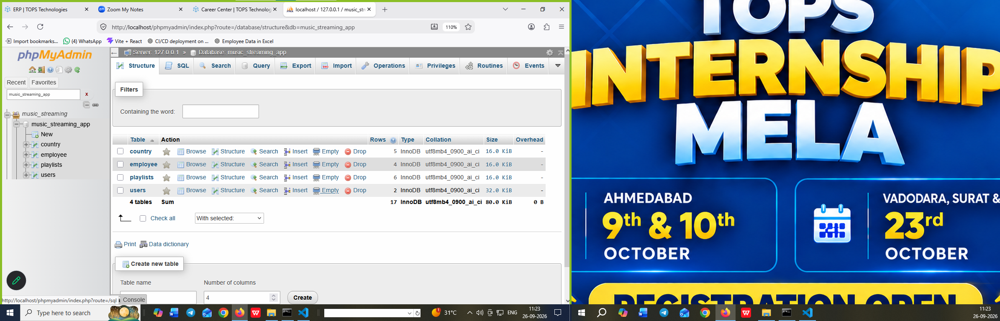
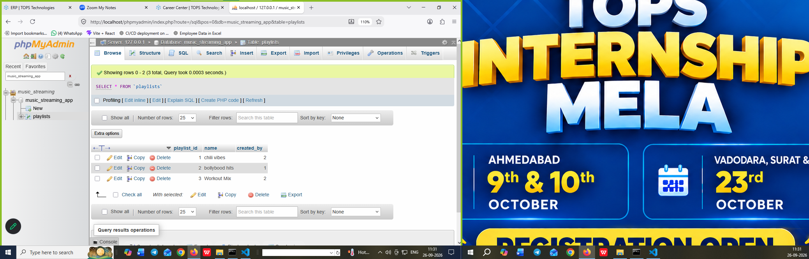
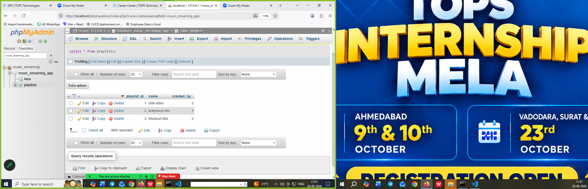

# Tasks
1. Install MySQL or PostgreSQL on your system and create a new database named 'music_streaming_app' using the command line or GUI tool of your choice.

2. Inside the 'music_streaming_app' database, create a table called 'playlists' with columns: playlist_id (integer, primary key), name (varchar), and created_by (varchar).

3. Insert three sample rows into the 'playlists' table representing playlists like 'Bollywood Hits', 'Chill Vibes', and 'Workout Mix', each created by a different user.

4. Write an SQL SELECT query to display all playlists created by the user 'Amit' from the 'playlists' table.<br><br><em><strong>Hint:</strong> Use the WHERE clause to filter by the 'created_by' column.</em>

5. Open ChatGPT or Copilot and ask it to explain the difference between a table, a row, and a column in SQL using an example from a food delivery app like Zomato. Paste the explanation you receive into your assignment.


**solutions**

1. create a database **music_streaming_app**

 **syntax**

 ```
 create database music_streaming_app;

 ```

 **screenshot**


**solutions**

3. create a table **playlists** and add three playlist name by users

 **syntax**



4. select all play list data 

   **syntax**

   ```
   select * from playlist
   ``` 




5. Open ChatGPT or Copilot and ask it to explain the difference between a table, a row, and a column in SQL using an example from a food delivery app like Zomato


Think of a SQL table like a spreadsheet of **Zomato orders**:

| order_id | customer | restaurant | total |
|---|---|---|---:|
| 501 | Asha | Spice Garden | 420 |
| 502 | Ravi | Pizza Point | 650 |

- **Table:** The whole collection of related data, here named `orders`.

- **Column:** A type of information stored for every order, such as `restaurant` or `total`.

- **Row:** One complete order record. For example, the row starting with `501` describes Asha’s order.


In SQL, you might retrieve the restaurant names with:

```sql
SELECT restaurant
FROM orders;
```


