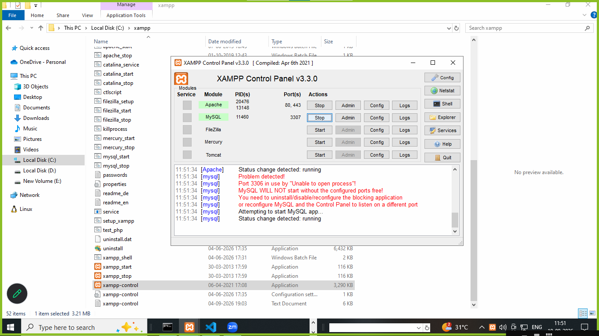
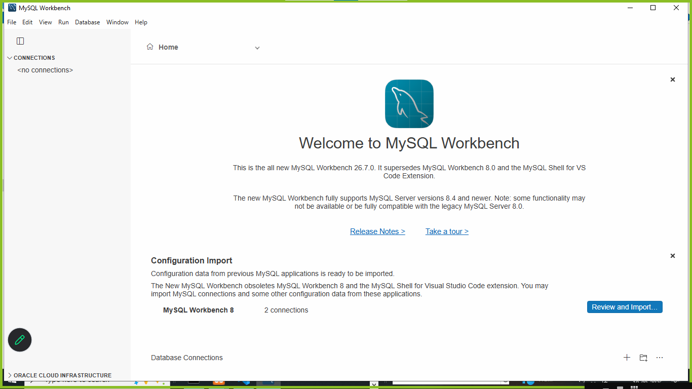
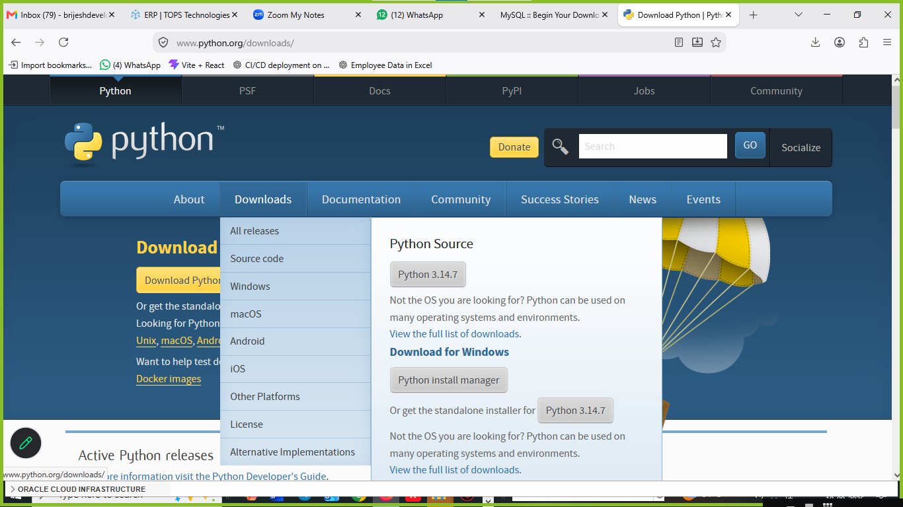
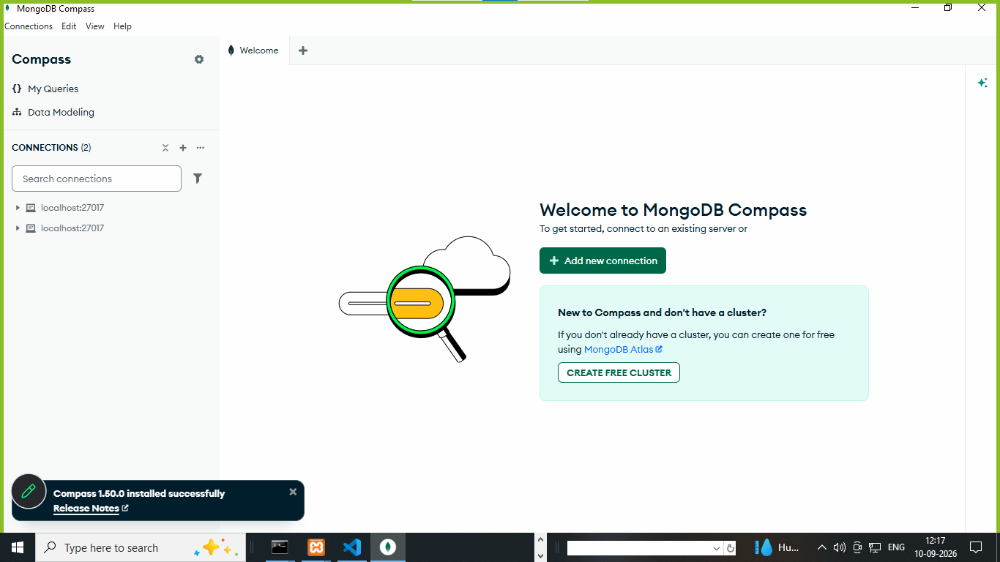
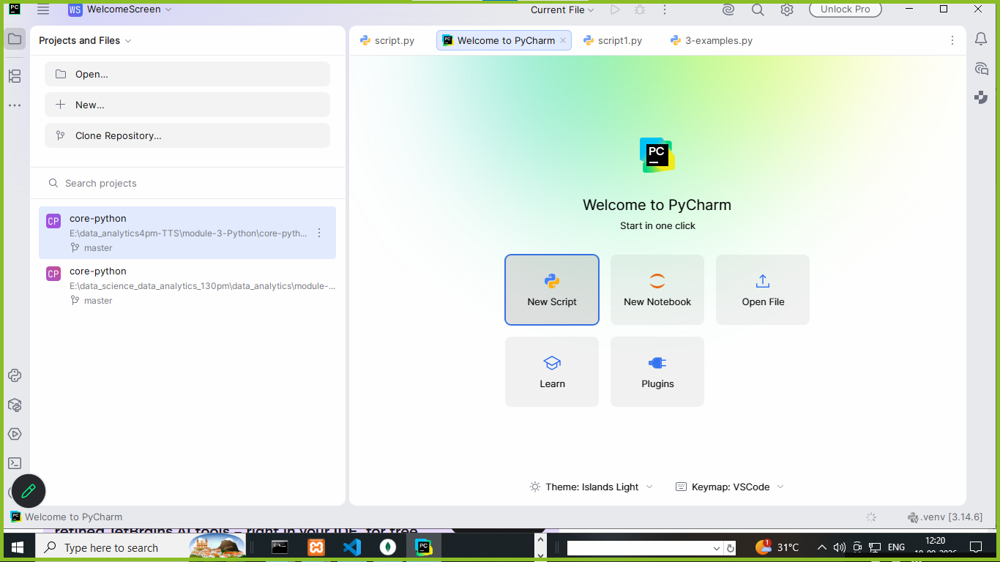
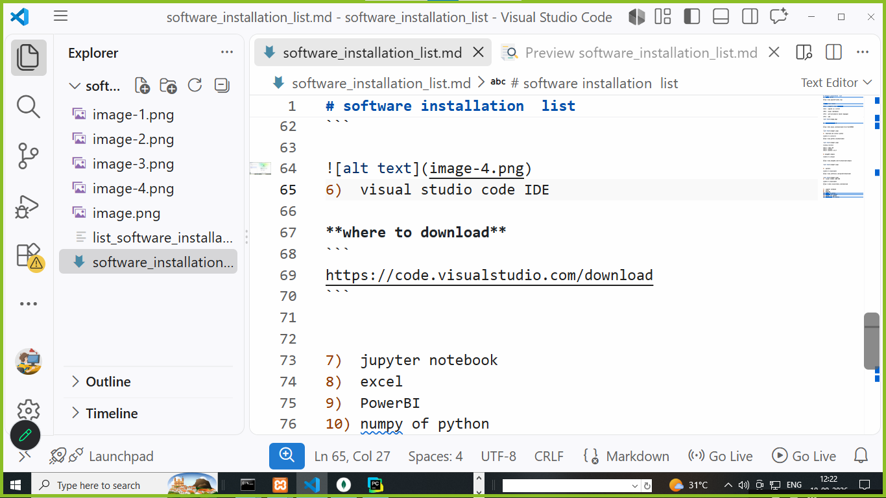
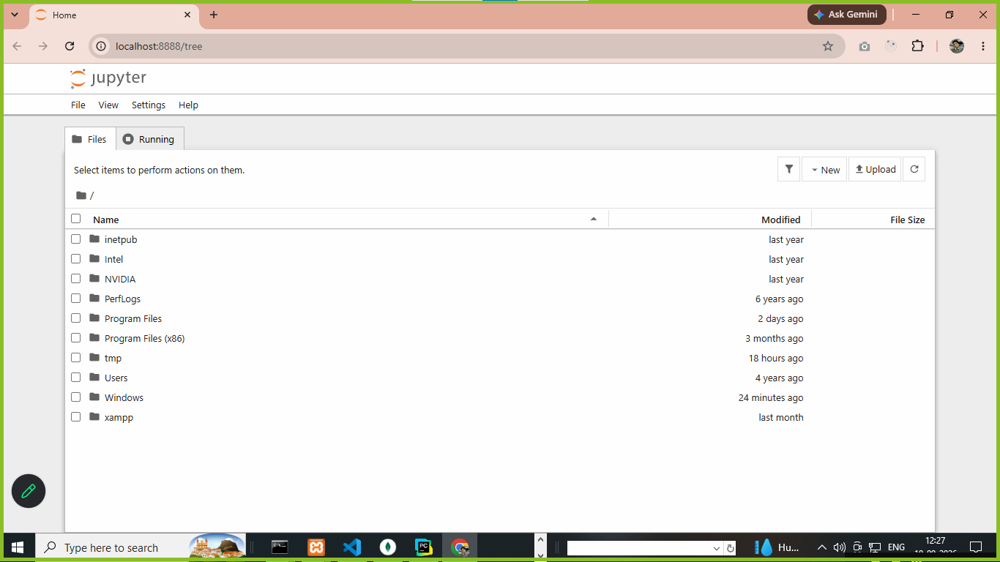
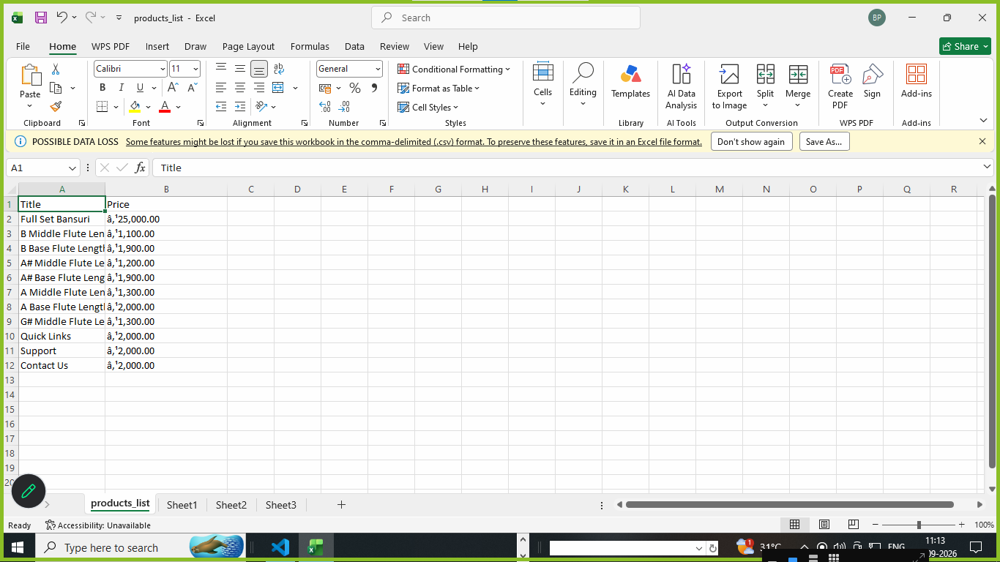
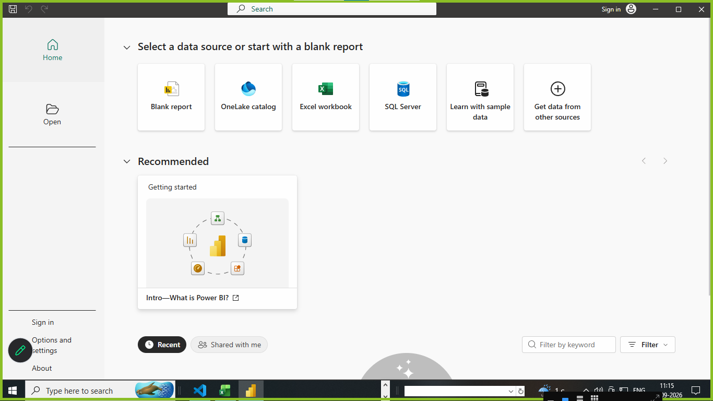

# software installation  list 
1)  xampp server
```
https://www.apachefriends.org/

```
**xampp full form**

**X** : support cross plateform

**A** : apache is a server

**M** : mysql (database)

**P** : perl(procedural based language)

**P** : php




2) **mysqlworkbench8.0**

```
https://dev.mysql.com/downloads/file/?id=559064

```


3)  download and install python

**where to install**
```
https://www.python.org/downloads/
```



**setup verify**

step 1: open cmd
step 2: python 
step 3: python 3.14.7

4) **mongoDB compass**

**where to setup**

```
https://www.mongodb.com/try/download/compass
``` 




5)  **pycharm**  IDE (integrated device environment) of python  

**where to download**

```
https://www.jetbrains.com/pycharm/download/
```



6) **visual studio code IDE**

**where to download**

```
https://code.visualstudio.com/download
```



7) **jupyter notebook** 

- jupyter notebook is simple IDE basically used for data science | data analytics | machine  learning 
- jupyter saved python code with extension .ipynb

**where to download**
```
Jupyter Notebook

Install the classic Jupyter Notebook with:

cmd : pip install notebook
To run the notebook:
cmd : jupyter notebook
cmd : pip show notebook

``` 



8) **excel**

**examples**

 

9) **PowerBI**
**where to install**
```
https://www.microsoft.com/en-us/download/details.aspx?id=58494
```




10) **numpy of python**

**cmd:** py -m pip install numpy
**cmd:** py -m pip show numpy

```
Name: numpy
Version: 2.5.1
Summary: Fundamental package for array computing in Python
Home-page: https://numpy.org
Author: Travis E. Oliphant et al.
Author-email:
License-Expression: BSD-3-Clause AND 0BSD AND MIT AND Zlib AND CC0-1.0
Location: C:\Users\Admin\AppData\Roaming\Python\Python314t\site-packages
Requires:
Required-by: contourpy, matplotlib, pandas, pydeck, seaborn, streamlit, transformers
```

**pip stands for python install package**

11) **seaborn for python**

**cmd :** pip install seaborn
**cmd:** pip show seaborn 

12) **pandas for python**
**cmd :** pip isntall pandas
**cmd:**  pip show pandas

13) **matplotlib for python**
**cmd :** pip install matplotlib
**cmd:** pip show matplotlib

# github setup ?

1. github is product of microsoft
2. github create a repository systems
3. create repository we upload our data in repository
4. after we shared public | private our data 

# create account on github
```
https://github.com/

```

# github commands to upload file 
# download git software or gitbash

```
https://git-scm.com/install/windows
```

1. git init
2. git add .
3. git commit -m "12-09-2026 all data uploaded"
4. git branch -M main or master
5. git remote add origin https://github.com/Brijesh1990/data_analytics-data_science_11amTTS.git
6. git push -u origin main or master

